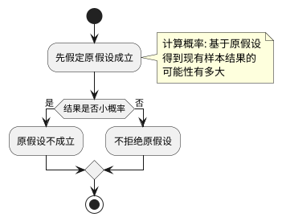

# 假设检验

想通过一次采样的特征，判断总体的差异

事先对总体参数或总体分布形式做出某种假设，然后利用样本信息来判断假设是否成立

## 原理
- 小概率原理: 小概率事件在一次事件中几乎不可能发生；在一次试验中**小概率事件一旦发生，就有理由拒绝原假设**
- 显著性水平(significance level)
  - 一般定为 $\alpha = 0.05$(小概率标准)
  - 置信水平即为 $1 - \alpha$



### 步骤


### 例子
总体：一直去年新生婴儿的平均体重为3190g，标准差为80.
问题：今年的新生婴儿与去年相比，体重有无显著差异？
样本：随机抽取100人，测得平均体重为3210

标准离差$z = \frac{\bar x - \mu_0}{\sigma / \sqrt{n}} = \frac{3210 - 3190}{80 / \sqrt{100}} = 2.5$

计算拒绝域
```R
> qnorm(0.025)
[1] -1.959964
```
我们取双侧$(-\infin, -1.959964) \cup (1.959964, \infin)$都是拒绝域

$2.5 \in 拒绝域中$

可以判断今年新生婴儿和去年相比体重有显著差异

## 单个总体的均值检验
### 研究问题

|假设|双侧检验|左侧检验|右侧检验|
|:--:|:--:|:--:|:--:|
|原假设$H_0$|$\mu = \mu_0$|$\mu \ge \mu_0$|$\mu \le \mu_0$|
|备择假设$H_1$|$\mu \neq \mu_0$|$\mu \lt \mu_0$|$\mu \gt \mu_0$|

### 情况
- 方差$\sigma^2$已知$z = \frac{\bar x - \mu_0}{\sigma / \sqrt{n}} \sim N(0,1)$
- 方差$\sigma^2$未知，大样本(大于30)，样本的方差可以代替$z = \frac{\bar x - \mu_0}{s / \sqrt{n}} \sim N(0,1)$
- 方差$\sigma^2$未知，小样本，利用t分布$t = \frac{\bar x - \mu_0}{\sigma / \sqrt{n}} \sim t(n-1)$

**要检验样本所取自的总体的参数是否大于某个特定值时，则采用右单侧检验；反之，若验的是样本所取自的总体的参数是否小于某个特定值时，则采用左单侧检验。**用来支持**备择假设**
### 实例分析

#### 方差已知
正常工作时候，平均长度10.5、标准差0.15
$\alpha = 0.05$ -> 置信度 $1-\alpha = 0.95$
```R
x = c(10.4, 10.9, 10.6, 10.1, 10.8, 10.1, 10.4, 10.5, 10.6, 10.3)
z.test(x, alternative="two.sided", mu=10.5, sigma.x=0.15, conf.level=0.95)
```

#### 方差未知小样本
是否有理由认为平均寿命大于225，greater取右侧检验
```R
x <- c(158,280, 101, 313, 152, 123, 152, 525, 252)
t.test(x, alternatiave="greater", mu=225)
```

## 两个总体的均值检验
### 研究问题
|假设|双侧检验|左侧检验|右侧检验|
|:--:|:--:|:--:|:--:|
|原假设$H_0$|$\mu_1 - \mu_2 = 0$|$\mu_1 - \mu_2 \ge 0$|$\mu_1 - \mu_2 \le 0$|
|备择假设$H_1$|$\mu_1 - \mu_2 \neq 0$|$\mu_1 - \mu_2 \lt 0$|$\mu_1 - \mu_2 \gt 0$|
### 情况
- $\sigma_1^2$和$\sigma_2^2$已知，检验统计量为$z=\frac{(\bar x_1 - \bar x_2) - (\mu_1 - \mu_2)}{\sqrt{\frac{\sigma_1^2}{n_1} + \frac{\sigma_2^2}{n_2}}}$
- $\sigma_1^2$和$\sigma_2^2$未知$\sigma_1^2 = \sigma_2^2$，且n较小，检验统计量$z=\frac{(\bar x_1 - \bar x_2) - (\mu_1 - \mu_2)}{s_p\sqrt{\frac{1}{n_1} + \frac{1}{n_2}}}$，其中$s_p = \frac{(n_1 - 1)s_1^2 + (n2-1)s_2^2}{n_1 + n_2 - 2}$
- $\sigma_1^2$和$\sigma_2^2$未知，$\sigma_1^2 \neq \sigma_2^2$，且n较小，检验统计量为$t=\frac{(\bar x_1 - \bar x_2) - (\mu_1 - \mu_2)}{\sqrt{\frac{s_1^2}{n_1} + \frac{s_2^2}{n_2}}} \sim t(df^{'})$，其中$df^{'} = \frac{(\frac{s_1^2}{n_1} + \frac{s_2^2}{n_2})^2}{\frac{(s_1^2/n_1)^2}{n_1 - 1} + \frac{(s_2^2/n_2)^2}{n_2 - 1}}$

### 实例分析
#### 方差都知道
根据历史资料得知，A、B两种机器生产出的弹簧其抗拉强度的标准差分别为8公斤和10公斤。从两种机器生产的产品中各抽取一个随机样本，样本容量分别为n1=32，n2=40，测得两个样本的均值分别为50和44公斤。问这两种机器生产的弹簧，平均抗拉强度是否有显著差别？$\alpha = 0.05$
$z=\frac{(\bar x_1 - \bar x_2) - (\mu_1 - \mu_2)}{\sqrt{\frac{\sigma_1^2}{n_1} + \frac{\sigma_2^2}{n_2}}} = \frac{50 - 44 - 0}{\sqrt{\frac{64}{32} - \frac{100}{40}}} = 2.83$

$2.83 \gt 1.96$在拒绝域中

说明两种机器产生的弹簧抗拉强度有显著差异

```R
A = c(50 + rnorm(32,0,8))
mean(A)
B = c(44 + rnorm(40,0,10))
mean(B)
z.test(A, B, alternative="two.sided", sigma.x=8, sigma.y=10, conf.level=0.95)
```
这段代码用于生成两个样本数据集 A 和 B，并使用 z.test 函数对这两个样本进行假设检验，以比较它们的均值是否有显著差异。让我逐步解释这段代码的含义：

1. `A = c(50 + rnorm(32, 0, 8))`
   这行代码创建了一个长度为 32 的样本数据集 A。该数据集由 50 加上来自均值为 0、标准差为 8 的正态分布的随机数生成而成。换句话说，它**模拟了一个均值为 50、标准差为 8 的总体**。

2. `B = c(44 + rnorm(40, 0, 10))`
   这行代码创建了一个长度为 40 的样本数据集 B。它也是通过在 44 上加上来自均值为 0、标准差为 10 的正态分布的随机数生成而成。这个数据集**模拟了一个均值为 44、标准差为 10 的总体**。

3. `z.test(A, B, alternative = "two.sided", sigma.x = 8, sigma.y = 10, conf.level = 0.95)`
   这行代码调用了 z.test 函数进行假设检验。该函数接受两个样本数据集 A 和 B，并通过比较它们的均值来检验它们之间的差异。参数 alternative 指定了检验的双侧性，sigma.x 和 sigma.y 分别指定了样本 A 和 B 的标准差，conf.level 指定了置信水平。
#### 方差不知道但相等
欲研究A、B两种方法组装某种产品所用的时间是否相同。选取部分工人进行抽样分析。已知用两种工艺组装产品所用时间服从正态分布，且方差相等。试问能否认为B方法比A方法组装更好？$\alpha = 0.05$
|组装方法|A|B|
|:--:|:--:|:--:|
|工人数n|10|8|
|平均时间（分）|26.1|17.6|
|样本标准差|12|10.5|

提出假设
- $H_0 = \mu_1 - \mu_2 \le 0$
- $H_1 = \mu_1 - \mu_2 \gt 0$

B比A好即$H_0$，因此是右侧检验

#### 方差不知道但相等

```R
# 样本数据集
standard <- c(78.1, 72.4, 76.2, 74.3, 77.4, 78.4, 76.0, 75.5, 76.7, 77.3)
new <- c(79.1, 81.0, 77.3, 79.1, 80.0, 79.1, 79.1, 77.3, 80.2, 82.1)

# 使用t.test函数进行假设检验
result <- t.test(new, standard, alternative = "greater", var.equal = TRUE, conf.level = 0.95)

# 输出检验结果
result
```
新的更好即$H_0 = \mu_1 - \mu_2 \ge 0$左侧检验

#### 方差不知道不相等n较小
```R
# 创建两组示例数据
vector1 <- c(1, 2, 3, 4, 5)
vector2 <- c(6, 7, 8, 9, 10)

# 执行两样本t检验
result <- t.test(vector1, vector2, var.equal = FALSE)

# 输出结果
print(result)
```
## 单个总体的方差检验
判断方差是否等于给定值
$\chi^2 = \frac{(n - 1)s^2}{\sigma_0^2} \sim \chi^2(n - 1)$
### 实例分析
某厂所产导线的电阻 服从正态分布，其方差为0.0025。现从某日产品中随机抽取20根，测得样本方差为0.0042。试判断该机工作是否正常？ $\alpha = 0.05$ 

提出原假设和备择假设
- $H_0：\sigma^2 = 0.0025$
- $H_1：\sigma^2 \ne 0.0025$

构建检验统计量
$\chi^2 = \frac{(n - 1)s^2}{\sigma_0^2} = \frac{(20 - 1) \times 0.0042}{0.0025} = 31.92$

求拒绝域，双侧检验
注意这个19为n-1，即样本数-1
```R
> qchisq(1 - 0.05 / 2, df = 19)
[1] 32.85233
> qchisq(0.05/2, df = 19)
[1] 8.906516
```


## 两个总体的方差检验
判断方差是否相等
检验统计量$F = \frac{s_1^2/\sigma_1^2}{\s_2^2/\sigma_2^2} \sim F(n_1 - 1, n_2 - 1)$

### 实例分析
•两台车床加工同一零件，分别取6件和9件测量直径，得$s_1^2 = 0.345, s_2^2 = 0.357$。假定零件的直径服从正态分布，能否据此断定两个总体的方差相等？$\alpha = 0.05$

提出原假设与备择假设
- $H_0: \sigma_1^2 = \sigma_2^2$
- $H_1: \sigma_1^2 \ne \sigma_2^2$

构建检验统计量
$F = \frac{s_1^2}{s_2^2} = \frac{0.345}{0.357} = 0.964$

确定拒绝域
```R
> qf(0.025, 5, 8)
[1] 0.1479909
> qf(1 - 0.025, 5, 8)
[1] 4.817276
```
这里5、8分别为$F(n_1 - 1, n_2 - 1)$中的$n_1 - 1/n_2 - 1$

发现不在拒绝域中，说明方差没有显著差异