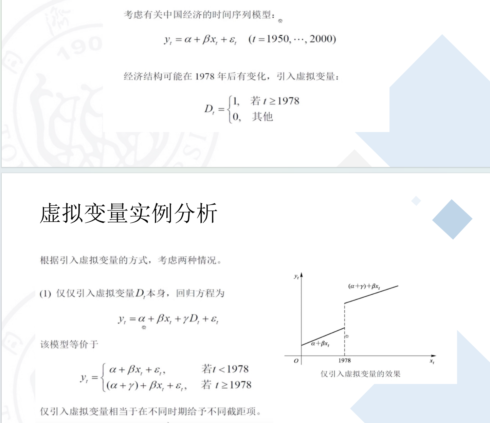
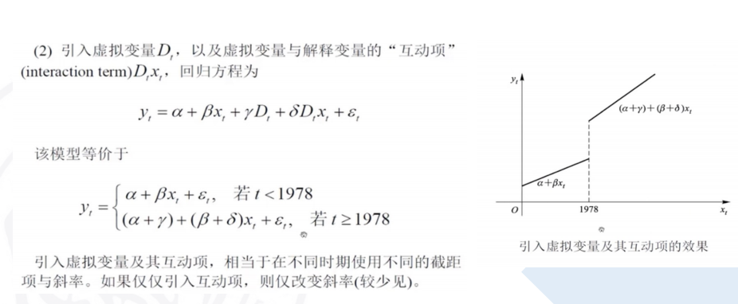

# 回归分析

对于具有**相关关系**的两个或两个以上变量之间的数量变化的一般关系及逆行测定，确定因变量和自变量之间的数量变动关系的**数学表达式**，以便对因变量进行估计或预测的统计分析方法

**一定要满足这些约束才能用**
- 得是线性
- 影响因素不能多重贡献，相关性很低
- 残差均值为零、方差相同的正太分布

相比DL，不容易over fitting

## 分类
### 一个自变量：一元回归
- 线性回归
- 非线性回归
### 两个及以上自变量：多元回归
- 线性回归
- 非线性回归

## 一元线性回归
### 线性回归模型
$f(x_i) = wx_i + b$ such that $f(x_i) \cong y_i$
### Mean squared error
$MSE = \frac{1}{m} \sum_{i=1}^{m}(f(x_i) - y_i)^2$

we want to minimize MSE between $f(x_i)$ and $y_i$
$(w^{*}, b^{*}) = arg \quad min_{(w,b)}\sum^{m}_{i=1}(f(x_i) - y_i)^2$
$= arg \quad min_{(w,b)}\sum^{m}_{i=1}(f(x_i) - wx_i - b)^2$

极值求导(单变量)
$\frac{df}{dx}|_{x_0} = 0$
或者求偏导(多变量)
$\frac{df}{dx_1}|_{x_0} = 0$
$\frac{df}{dx_2}|_{x_2} = 0$
...
$\frac{df}{dx_n}|_{x_n} = 0$

### Ordinary Least Squares估计量
普通最小二乘估计量

$y_i$的估计值$\widehat{y_i} = \widehat{\alpha} + \widehat{\beta}x_i$
残差$e_i = y_i - \widehat{y_i} = y_i - \widehat{\alpha} - \widehat{\beta}x_i$
残差平方和(Sum of Squared Residuals)$\sum_{i=1}^{n}e^2_i = \sum_{i=1}^n(y_i - \widehat{\alpha} - \widehat{\because}x_i)^2$
普通最小二乘法的目标函数$min\sum_{i=1}^{n}e^2_i = \sum^n_{i=1}(y_i - \widehat{\alpha} - \widehat{\beta}x_i)^2$

我们求偏导
$min_{\widehat{\alpha}, \widehat{\beta}}\sum_{i=1}^{n}e^2_i = \sum^n_{i=1}(y_i - \widehat{\alpha} - \widehat{\beta}x_i)^2 \Rightarrow$
$\frac{\partial}{\partial \widehat{\alpha}} \sum^{n}_{i=1}e^2_i = -2\sum^n_{i=1}(y_i - \widehat{\alpha} - \widehat{\beta}x_i) = 0$
$\frac{\partial}{\partial \widehat{\beta}} \sum^{n}_{i=1}e^2_i = -2\sum^n_{i=1}(y_i - \widehat{\alpha} - \widehat{\beta}x_i)x_i = 0$

从而得出
$\sum^n_{i=1}e_i = 0$
$\sum^n_{i=1}x_ie_i = 0$

从几何上来理解
$\widehat{y}$为$x$的线性组合，因此在同一个平面上
又因为$\sum^n_{i=1}x_ie_i = 0$，因此$\widehat{y}$和$e$也是正交的
向量$\widehat{y}$加上$e$，就是$y$了


从而得出普通最小二乘公式
$\widehat{\beta} = \frac{\sum_{i=1}^n(x_i - \bar x)(y_i - \bar y)}{\sum^n(x_i - \bar x)^2}$
$\widehat{\alpha} = \bar y - \widehat{\beta}\bar x$

### OLS的正交性
$\widehat{y'}e \equiv (\widehat{y_i}, ..., \widehat{y_n}) 
\left(
\begin{array}
	{}
	e_{1} \\
	\vdots&\\
	e_{n}
\end{array}
\right)
= \sum^n_{i=1}(\widehat{\alpha} + \widehat{\beta}x_i)e_i \\
= \widehat{\alpha}\sum^n_{i=1}e_i + \widehat{\beta}\sum^n_{i=1}x_ie_i = 0
$
之前的方程组可以说明**残差向量$e$和拟合值向量$\widehat{y}$正交**

## 多元线性回归
### 线性模型
$y_i = \beta_0 + \beta_1x_{1i} + \beta_2x_{2i} + \beta_3x_{3i} + \varepsilon_i \qquad i = 1,...,n$
即为$y = X\beta + \varepsilon$
where $y = (y_1 ... y_n)^T, \varepsilon = (\varepsilon_1 ... \varepsilon_n)^T, \beta = (\beta_0...\beta_3)^T$ and $\left(
    \begin{array}{ccc}
          1 & x_{11} & x_{12} & x_{13}\\
          1 & x_{21} & x_{22} & x_{23}\\
          \cdots & & \cdots \\
          1 & x_{n1} & x_{n2} & x_{n3}\\
  \end{array}
  \right)$
- 这时候3为解释变量的个数
- n为样本个数s

### OLS正交性
$\widehat{y'}e = (X\widehat{\beta})'e = \widehat{\beta'} X' e = \widehat{\beta'} 0 = 0$

可以求解**OLS估计量$\widehat{\beta} \equiv (X^TX)^{-1}X^Ty$(假设$(X^TX)^{-1}$存在)**

### 回归系数估计
$E(\widehat{\beta}) = (X^TX)^{-1}X^TX\beta = \beta$
$Var(\widehat{\beta}) = (X^TX)^{-1}\sigma^2$

均方误差MSE估计
$\sigma^2 = \frac{\hat{\varepsilon}^T\hat{\varepsilon}}{n - p}$
其中$n - p$是模型的自由度

## 拟合优度
goodness of fit指**回归方程与观测数据的接近程度**
度量指标: 判定系数/决定系数/可决系数(coefficient of determination)

### SST分解
$SST = SSR + SSE$
总变差 = 残差 + 回归变差
$\sum(y-\bar y)^2 = \sum(y-y_c)^2 + \sum(y_c - \bar y)^2$

### 判定系数
$r^2 = \frac{SSR}{SST} = \frac{\sum(y_c - \bar y)^2}{\sum(y-\bar y)^2} = 1 - \frac{\sum(y - y_c)^2}{\sum(y-\bar y)^2} \in [0,1]$
表明自变量X的方法对因变量方差的解释程度

$r^2$为1最好，总变差可以完全由回归直线来解释，拟合完全
又不能说因为变量越多$r^2$也会因此越大，因此增加惩罚！
校正拟合优度$\bar R^2 = 1 - \frac{\sum^n_{i=1}e^2_i / (n - K)}{\sum^2_{n=1}(y_i - \bar y)^2 / (n - 1)}$
$\sum^n_{i=1}e^2_i$的自由度即为$(n - K)$

模型越简单越好，如果发现一个用了五个变量、一个用了两个变量，但是$r^2$差不多，那就用两个变量的

### 实例分析
```r
set.seed(123)
x=1:100
k=0.5
y=1+k*x+rnorm(100,0,1) # 生成有误差的数据点
model=lm(y~x) # 指定拟合y是x的线性函数
model$coefficients
(res = summary(model))
res$coefficients
```
输出
```
> model$coefficients
(Intercept)           x 
  0.9635961   0.5025111 

> (res=summary(model))

Call:
lm(formula = y ~ x)

Residuals:
     Min       1Q   Median       3Q      Max 
-2.45356 -0.55236 -0.03462  0.64850  2.09487 

Coefficients:
            Estimate Std. Error t value Pr(>|t|)    
(Intercept) 0.963596   0.184287   5.229 9.66e-07 ***
x           0.502511   0.003168 158.611  < 2e-16 ***
---
Signif. codes:  0 ‘***’ 0.001 ‘**’ 0.01 ‘*’ 0.05 ‘.’ 0.1 ‘ ’ 1

Residual standard error: 0.9145 on 98 degrees of freedom
Multiple R-squared:  0.9961,	Adjusted R-squared:  0.9961 
F-statistic: 2.516e+04 on 1 and 98 DF,  p-value: < 2.2e-16

> res$coefficients
             Estimate Std. Error    t value      Pr(>|t|)
(Intercept) 0.9635961  0.1842874   5.228768  9.663888e-07
x           0.5025111  0.0031682 158.610917 5.764300e-120
```
这些输出是对线性回归模型的各种统计指标和参数估计的分析结果。让我们逐个解释：

1. `model$coefficients`显示了模型估计的系数。
   - `(Intercept)`: **截距项**的估计值为约0.964。
   - `x`: x的系数($\alpha$)估计值约为0.503。

2. `summary(model)`或`(res=summary(model))`生成的`res`对象包含了更详细的回归模型摘要。
   - **Call**: 显示了执行回归分析时用的函数调用和模型公式。
   - **Residuals**: 显示了模型的**残差统计信息**，包括最小值、第一四分位数、中位数、第三四分位数和最大值。
   - **Coefficients**: 这一部分提供了各个预测变量的系数估计。包括了系数的估计值、标准误差、t值和p值。
     - `Estimate`列显示了截距和自变量x的系数的估计值，与`model$coefficients`的输出相同。
     - `Std. Error`是系数的标准误差。
     - `t value`是t统计量的值，用于**检验系数是否显著地不同于零**。
     - `Pr(>|t|)`是基于**t统计量得出的p值**，它表示了系数是否统计显著（即不等于零）的概率。要是等于零了就不考虑这个变量了
   - **Residual standard error**: 残差标准误差是对观测值与回归线之间离差的平均测量，约为0.9145。
   - **Multiple R-squared**: 多重R平方是指模型拟合数据的程度，接近1表示模型很好地解释了因变量的变化，这里为约0.9961。
   - **Adjusted R-squared**: (校正拟合优度)调整后的R平方考虑了模型中的自由参数数量，是对多重R平方的修正，也约为0.9961。
   - **F-statistic**: F统计量用于检验整个模型的显著性。
   - **Degrees of freedom**: 自由度，表示用于计算误差的独立观测值的数量。
   - **p-value**: F统计量对应的p值，表明模型的整体显著性。这里p值非常接近零，表明模型整体显著。

这些统计结果可以帮助你评估模型的质量、系数的显著性以及模型是否适合解释数据。

### 估计标准误
Standard error of estimate，是对各观测数据在**回归直线周围分散程度的度量值**，反映了用估计的回归方程拟合因变量$y$的平均误差大小。
$S_{yx}$是对误差项$\varepsilon$的标准差$\sigma$的无偏估计

$S_{yx} = \sqrt{\frac{\sum(y-y_c)^2}{n-2}}$
**各个观测数据越靠近回归直线，估计标准误就越小，回归直线的代表性就越好**

那么`summary(model)`中的`Residual standard error: 0.9145 on 98 degrees of freedom`就展示了估计标准误的结果

## 统计检验
### 模型整体拟合效果的显著性检验
1. 提出假设
   - $H_0: \beta_0 = \beta_1 = 0$
   - $H_1: \beta_0 \ne 0$或$\beta_1 \ne 0$
2. 构造检验统计量
   $F = \frac{SSR/(K-1)}{SSE/(n-K)}$
3. 根据跟定的显著性水平$\alpha$，确定临界值$F_{\alpha}$
4. 决策

那么`summary(model)`中的`F-statistic: 2.516e+04 on 1 and 98 DF,  p-value: < 2.2e-16`就展示了F检验的结果
检测是否在统计上有意义
### 归回系数的显著性检验(自变量对于回归模型是否有必要)
1. 提出假设
   - $H_0: \beta_0 = 0$
   - $H_1: \beta_0 \ne 0$
2. 构造检验统计量
   $t_k = \frac{\widehat{\beta_k} - c}{SE(\widehat{\beta_k})} = \frac{\widehat{\beta_k} - c}{\sqrt{s^2(X'X)_{kk}^{-1}}} \sim t(n-K)$
3. 根据跟定的显著性水平$\alpha$，确定临界值$t_{\alpha/2}(n-K)$
4. 决策

那么`summary(model)`中的
```
Coefficients:
            Estimate Std. Error t value Pr(>|t|)    
(Intercept) 0.963596   0.184287   5.229 9.66e-07 ***
x           0.502511   0.003168 158.611  < 2e-16 ***
```
就展示了t检验的结果
检测单个变量是否有影响，不显著等于0就要去掉这个变量

## 虚拟变量
虚拟变量（Dummy Variables）是用来表示**分类变量**的一种方法，在回归分析中常用于处理分类或分组数据。当你有一个**分类变量**，用数字代表分组，但它**不是连续的数值型变量**时，可以将其转换为虚拟变量，使其能够被回归模型所理解和使用。

比方差分析厉害，可以定性分析离散变量的影响

虚拟变量通常以0和1的形式表示。例如，考虑一个拥有两个水平（比如性别：男和女）的分类变量，在回归分析中可以用**一个**虚拟变量来表示：
- 假设我们用$X$表示性别变量，1代表男性，0代表女性。这个变量就是一个虚拟变量。
- 回归模型中的系数就代表着在不同性别水平上因变量的平均差异。
  
假设我们有五个大洲：亚洲、欧洲、非洲、北美洲和南美洲。为了用虚拟变量来表示这五个大洲，可以这样操作：

**创建四个虚拟变量**：

- 假设我们使用四个虚拟变量 \(x_1, x_2, x_3, x_4\) 分别表示亚洲、欧洲、非洲和北美洲。南美洲可以作为基准类别，因此不需要单独的虚拟变量来表示。

- 如果一个观测值对应于南美洲，那么四个虚拟变量的取值都为0；如果对应于其他洲，对应的虚拟变量取值为1。

**因此某个定性指标需要分成M类，则最多只能在方程中放入(M - 1)个虚拟变量**

### 实例分析

仅引入虚拟变量相当于有不同截距

还引入互动项$D_ix_i$，相当于有不同截距和斜率
## 模型优化
模型衡量指标AIC(Akaike information criterion)
$AIC = 2k - 2ln(L)$(k为参数的数量，L为似然函数)

就比较low，不如前面人来分析的


1. **AIC进行模型选择：**
   - 使用AIC进行模型选择的方法，尤其是在向前或向后逐步回归中，会根据AIC值来选择变量，从而构建更复杂或更简单的模型。它会考虑到模型的复杂性（参数数量）和拟合数据的质量之间的权衡，尽可能地在模型的预测能力和模型的复杂性之间取得平衡。
   - AIC较小的模型往往被视为对数据更好地进行拟合或更具泛化能力。

2. **直接使用 `lm()` 函数：**
   - 直接使用 `lm()` 函数拟合模型时，不考虑模型选择。它会使用你所提供的自变量来拟合一个线性回归模型，但不会进行变量选择或调整模型以适应数据。

AIC的使用能够帮助避免过度拟合（Overfitting）的问题，即模型过于复杂，试图完美拟合训练数据，但泛化到新数据时效果不佳。因此，AIC可以帮助选择更简单的模型，从而提高模型的泛化能力。


1. **向前逐步回归分析（Forward Stepwise Regression）**

```r
# 这是数字一啊 从最简单的没有其他的自变量 直接 mean(mpg)
intercept_only = lm(mpg ~ 1, data = mtcars)

# 最复杂的 所有的都是它的自变量
all = lm(mpg ~ ., data = mtcars)

# 从最简单的开始 依次加入一个自变量
forward = step(intercept_only, direction = "forward", scope = formula(all), trace = 0)

forward$anova

forward$coefficients
```

输出结果
```r
> forward$anova
   Step Df  Deviance Resid. Df Resid. Dev       AIC
1       NA        NA        31  1126.0472 115.94345
2  + wt -1 847.72525        30   278.3219  73.21736
3 + cyl -1  87.14997        29   191.1720  63.19800
4  + hp -1  14.55145        28   176.6205  62.66456
> forward$coefficients
(Intercept)          wt         cyl          hp 
 38.7517874  -3.1669731  -0.9416168  -0.0180381 
```
- `lm(mpg ~ 1, data = mtcars)` 创建一个只包含截距项的模型。
- `lm(mpg ~ ., data = mtcars)` 创建一个包含所有可能预测变量的模型。
- `step()` 函数执行了向前逐步回归分析。`direction = "forward"` 表示向前选择变量，`scope = formula(all)` 表示在所有可能的预测变量中进行选择。
- `trace = 0` 表示不显示每一步的详细输出信息。

结果：

- `forward$anova` 显示了每一步的回归模型的拟合统计信息，包括变量的逐步加入情况和对应的AIC值。
- `forward$coefficients` 显示了最终模型中的系数估计值，帮我找一个AIC最小的即最好的拟合。

1. **向后逐步回归分析（Backward Stepwise Regression）**
```r
intercept_only = lm(mpg ~ 1, data = mtcars)

all = lm(mpg ~ ., data = mtcars)

backward = step(all, direction = "backward", scope = formula(all), trace = 0)

backward$anova

backward$coefficients
```
输出结果
```r
> backward$anova
    Step Df   Deviance Resid. Df Resid. Dev      AIC
1        NA         NA        21   147.4944 70.89774
2  - cyl  1 0.07987121        22   147.5743 68.91507
3   - vs  1 0.26852280        23   147.8428 66.97324
4 - carb  1 0.68546077        24   148.5283 65.12126
5 - gear  1 1.56497053        25   150.0933 63.45667
6 - drat  1 3.34455117        26   153.4378 62.16190
7 - disp  1 6.62865369        27   160.0665 61.51530
8   - hp  1 9.21946935        28   169.2859 61.30730
> backward$coefficients
(Intercept)          wt        qsec          am 
   9.617781   -3.916504    1.225886    2.935837 
```
- `lm(mpg ~ 1, data = mtcars)` 创建一个只包含截距项的模型。
- `lm(mpg ~ ., data = mtcars)` 创建一个包含所有可能预测变量的模型。
- `step()` 函数执行了向后逐步回归分析。`direction = "backward"` 表示向后选择变量，`scope = formula(all)` 表示在所有可能的预测变量中进行选择。
- `trace = 0` 表示不显示每一步的详细输出信息。

结果：

- `backward$anova` 显示了每一步的回归模型的拟合统计信息，包括变量的逐步剔除情况和对应的AIC值。
- `backward$coefficients` 显示了最终模型中的系数估计值，同样是找一个AIC最小的即最好的拟合。

## 实例分析

最后可以利用`RMSE`、`MAC`等判断模型好坏

测试集还得手工算