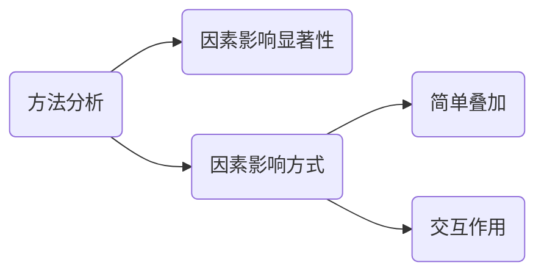
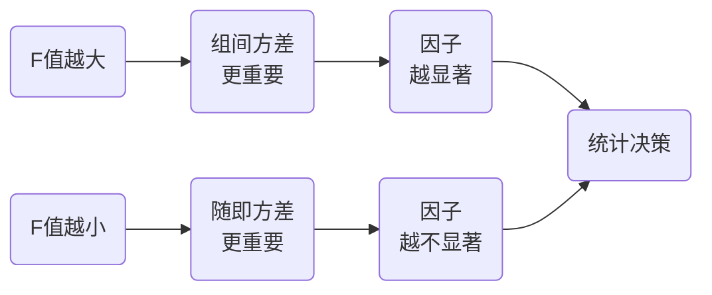
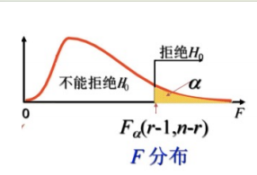
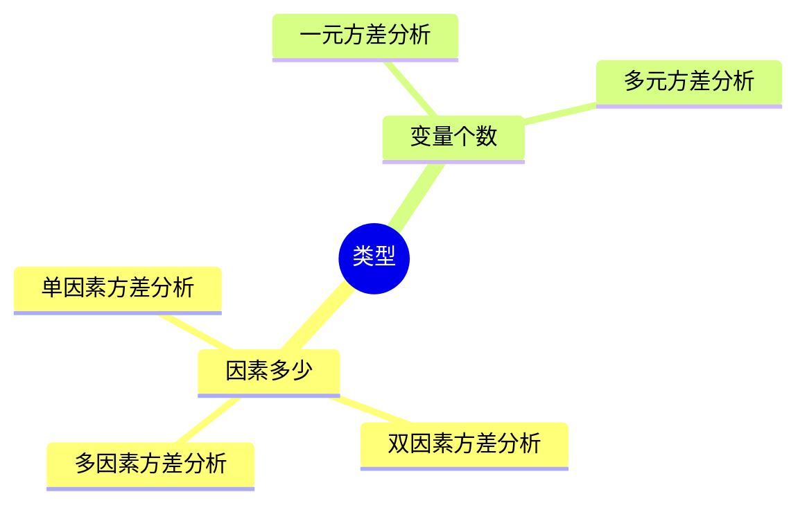
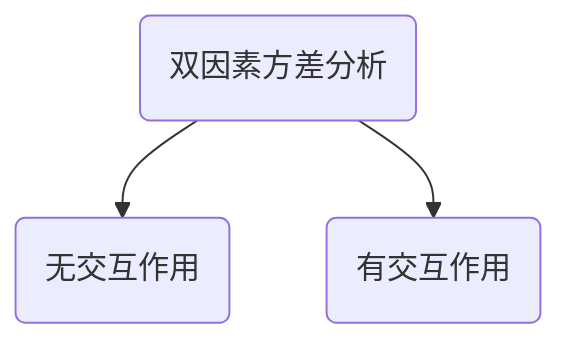

# 方差分析

对离散的影响因素对多个总体的影响分析
方差分析（Analysis of Variance，简称ANOVA）是一种统计方法，它用于**比较两个或多个组或处理之间的均值差异是否显著**。方差分析可以帮助我们确定因素对于观察结果的影响，以及它们之间是否存在统计学上的显著差异。

方差分析的基本思想是将总体方差分解为不同来源的变异成分，例如组内变异和组间变异。组内变异是由于不同观察值之间的个体差异导致的，而组间变异则是由于所研究的因素（例如不同的处理或组别）导致的。

在方差分析中，我们需要明确三个关键概念：

1. 因变量（Dependent Variable）：要测量或观察的数量或性质，对其进行了多个组的比较。

2. 自变量（Independent Variable）：用来定义组别或处理的因素，例如不同的治疗方式或不同的组别。

3. 组（Group）：由自变量定义的分类或处理，比如不同的实验组或不同的条件。

ANOVA会通过计算组间变异与组内变异之间的比例，来判断**组别之间的均值差异是由于随机因素还是由于因素的差异所导致的**。这个比例由 F 统计量表示，**F 统计量的值越大**，表示**组间的差异**相对于**随机因素的差异**更为**显著**。

在进行方差分析之前，我们需要明确研究的假设，例如零假设（H0）表明组间的均值没有显著差异，备择假设（H1）则表明**组间的均值**存在显著差异。

## 方差分析的作用


## 方差分析的本质

对多个正态分布总体的均值比较问题

## 统计量
$F = \frac{MS_{bet}}{MS_{W}} = \frac{\frac{\sum n_i (\bar x_i - \overline{\bar x})}{k - 1}}{\frac{\sum \sum (x_{ij} - \bar x_i)^2}{n - k}} \sim F(k-1, n-k)$
$k$为因素的个数，$n$为总样本量

- **组间均方**(Mean-square-between)，关注组件的差异
  - 组间均数的方差
  - 这里有个每个组的均值的均值
- **组内均方**(Mean-square-within)，关注多组之间的组内差异
  - 样本量不同：汇合方差
  - 样本量相同：正好等于各组方差的均数
  - $\sum \sum (x_{ij} - \bar x_i)^2$即为每组的残差然后求和

**自由度**
- $df_{bet} = k - 1$
  - $k$为组数
- $df_W = n - k$
  - $n$为总样本量，每组的样本量加起来

**判断**
如果算出来的$F$值大于查出来的临界值的对应分位数？，就可以拒绝零假设，认为存在差异；反之**没有能拒绝**认为不存在显著差异



但方差分析不能告诉我们具体是哪两组之间存在显著差异



## 举例
- 教学方法、教师素质、学生基础等影响因素统计学教学的效果
- 超市产品销售取决于产品品牌、款式、材料、加个等多种因素
- 某疾病的手术交过取决于患者年龄、患病程度、手术条件等因素
- 网站访问量取决于网站主题、网页界面、内容丰富程度等因素

## 方差分析的类型

### 单因素方差分析
只考虑一种因素对观察（试验）指标影响的方差分析

#### 基本假设
- 样本都是独立于其他样本
- 不同组的数据方差应该是相同的
- 每个样本都是从正太分布的人群中抽取的

#### 实例分析
利用儿童运动饮料试销量的数据，进行单因素方差分析，三种包装形式对饮料销售量的影响是否具有显著差异(0.05)
<table>
    <tr>
        <th rowspan="2">包装类型</th>
        <th colspan="8">商店</th>
    </tr>
    <tr>
        <th>I</th>
        <th>II</th>
        <th>III</th>
        <th>IV</th>
        <th>V</th>
        <th>VI</th>
        <th>VII</th>
        <th>VIII</th>
    </tr>
    <tr>
        <td>纸质真空</td>
        <td>152</td>
        <td>188</td>
        <td>238</td>
        <td>192</td>
        <td>180</td>
        <td>115</td>
        <td>125</td>
        <td>100</td>
    </tr>
    <tr>
        <td>纸质真空</td>
        <td>152</td>
        <td>188</td>
        <td>238</td>
        <td>192</td>
        <td>180</td>
        <td>115</td>
        <td>125</td>
        <td>100</td>
    </tr>
    <tr>
        <td>铁质易拉罐</td>
        <td>208</td>
        <td>256</td>
        <td>300</td>
        <td>280</td>
        <td>270</td>
        <td>210</td>
        <td>185</td>
        <td>165</td>
    </tr>
    <tr>
        <td>塑料瓶</td>
        <td>182</td>
        <td>198</td>
        <td>268</td>
        <td>220</td>
        <td>200</td>
        <td>128</td>
        <td>110</td>
        <td>105</td>
    </tr>
</table>

**R code**
```R
x = c(152, 188, 238, 192, 189, 115, 125, 100, 208, 256, 300, 280, 270, 210, 185, 165, 182, 198, 268, 220, 200, 128, 110, 105)
group = c(rep("A1", 8), rep("A2", 8), rep("A3", 8))
dat = data.frame(x = x, group = group)
fit = aov(x ~ group, data = dat)
summary(fit)
```
输出结果
```
            Df Sum Sq Mean Sq F value Pr(>F)  
group        2  23231   11615   4.398 0.0254 *
Residuals   21  55463    2641                 
---
Signif. codes:  
0 ‘***’ 0.001 ‘**’ 0.01 ‘*’ 0.05 ‘.’ 0.1 ‘ ’ 1
```
整理成表格

|方差来源|自由度|离差平方和|均方差|F值|P值|
|:--:|:--:|:--:|:--:|:--:|:--:|
|因素A(组间)|2|23752.750|11876.375|4.530|0.023|
|随机误差E(组内)|21|55054.875|2621.661|--|--|
|总和|23|78807.625|--|--|--|

通过两种方法**判断**
- 临界值: $F = 4.53 > F_{0.95}(2, 21) = 3.505$
- P值法：$P = 0.023 < 0.05$

**决策**
拒绝$H_0$假设，认为有显著影响

### 双因素方差分析
方差分析中研究两种因素的影响

#### 类型


#### 无交互因素双因素方差分析

要说明因素A有无显著影响，就是要检验如下假设:
$H_{01}: \alpha_1 = \alpha_2 = ... = \alpha_r = 0$

备择假设:
$H_{11}: \alpha_1,..\alpha_r$不全为0

要说明因素B有无显著影响，就是要检验如下假设:
$H_{02}: \beta_1 = \beta_2 = ... = \beta_s = 0$
备择假设:
$H_{12}: \beta_1,..\beta_s$不全为0

而模型无显著效果是指以上两个假设的原假设同时成立。

#### 数学模型
$\bar x = \frac{1}{rs}\sum^{r}_{i=1}\sum^{s}_{j=1}x_{ij}$
$\bar x_i = \frac{1}{x}\sum^{s}_{j=1}x_{ij}$
$\bar x_j = \frac{1}{r}\sum^{r}_{i=1}x_{ij}$

##### 恒等关系
$x_{ij} - \bar x = (\bar x_i - \bar x) + (\bar x_j - \bar x) + (x_{ij} + \bar x - \bar x_i - \bar x_j)$
##### 平方求和
$\sum^r_{i=1}\sum^s_{j=1}(x_{ij} - \bar x)^2 = \sum^r_{i=1}\sum^s_{j=1}(\bar x_i - \bar x)^2 + \sum^r_{i=1}\sum^s_{j=1}(\bar x_j - \bar x)^2 + \sum^r_{i=1}\sum^s_{j=1}(x_{ij} + \bar x - \bar x_i - \bar x_j)^2$
##### 符号约定
$SS_r = \sum^r_{i=1}\sum^s_{j=1}(x_{ij} - \bar x)^2$
$SS_A = \sum^r_{i=1}\sum^s_{j=1}(\bar x_i - \bar x)^2$
$SS_B = \sum^r_{i=1}\sum^s_{j=1}(\bar x_j - \bar x)^2$
$SS_E = \sum^r_{i=1}\sum^s_{j=1}(x_{ij} + \bar x - \bar x_i - \bar x_j)^2$
##### 平方分解
$SS_T = SS_A + SS_B + SS_E$
即：总离差平方和 = A偏差平方和 + B偏差平方和 + 误差偏差平方和

##### 构造统计量
总和$\frac{SS_T}{S^2} \sim \chi^2(rs - 1)$
因素A$\frac{SS_A}{S^2} \sim \chi^2(r - 1)$
因素B$\frac{SS_B}{S^2} \sim \chi^2(s - 1)$
误差$\frac{SS_E}{S^2} \sim \chi^2((r - 1)(s - 1))$
统计量为
$F_A = \frac{\frac{SS_A}{S^2}}{\frac{SS_E}{S^2}} \sim F(r - 1, rs - r - s + 1)$
$F_B = \frac{\frac{SS_B}{S^2}}{\frac{SS_E}{S^2}} \sim F(s - 1, rs - r - s + 1)$

#### 实例分析
为了认识客户消费时段的特征，新开业的环山市旋门湾咖啡厅按消费时段统计消费额。每天分为上午、下午和晚上三个时段，每周七天全部营业。假设营业时段于营业日之间**不存在交互作用**，因此可只统计一周的数据。假设没有季节性的差异，也假设消费群体结构不会产生较大的变动，假设其他因素可忽略。现在的问题是：周内每天的消费额是否存在差异？一天之内的三个不同时段之间是否存在显著性差异？
<table>
    <tr>
        <th rowspan="2" colspan="2">时段</th>
        <th colspan="7">B因素</th>
        <th rowspan="2">平均</th>
    </tr>
    <tr>
        <th>周一</th>
        <th>周二</th>
        <th>周三</th>
        <th>周四</th>
        <th>周五</th>
        <th>周六</th>
        <th>周日</th>
    </tr>
    <tr>
        <td rowspan="3">A因素</td>
        <td>上午</td>
        <td>4152</td>
        <td>4852</td>
        <td>3546</td>
        <td>5456</td>
        <td>3426</td>
        <td>6124</td>
        <td>5846</td>
        <td>4771.71</td>
    </tr>
    <tr>
        <td>下午</td>
        <td>6852</td>
        <td>5112</td>
        <td>5786</td>
        <td>6105</td>
        <td>3998</td>
        <td>10124</td>
        <td>9789</td>
        <td>6823.71</td>
    </tr>
    <tr>
        <td>晚上</td>
        <td>9852</td>
        <td>8912</td>
        <td>9978</td>
        <td>9105</td>
        <td>15918</td>
        <td>16124</td>
        <td>10100</td>
        <td>11427.00</td>
    </tr>
    <tr>
        <td colspan="2">平均</td>
        <td>6952</td>
        <td>6292</td>
        <td>6436.67</td>
        <td>6888.67</td>
        <td>7780.67</td>
        <td>10790.7</td>
        <td>8578.33</td>
        <td>7674.14</td>
    </tr>
</table>

**R code**
```R
x = c(4152, 6852, 9852, 4852, 5112, 8912, 3546, 5786, 9978, 5456, 6105, 9105, 3426, 3998, 15918, 6124, 10124, 16124, 5846, 9789, 10100)
week = c(rep("Monday", 3), rep("Tuesday", 3), rep("Wednesday", 3), rep("Thursday", 3), rep("Friday", 3), rep("Saturday", 3), rep("Sunday", 3))
time = c(rep(c("Morning", "Afternoon", "Night"), 7))
dat = data.frame(x = x, week = week, time = time)
fit = aov(x ~ time + week, data = dat)
summary(fit)
aggregate(dat, by = list(week), mean)
aggregate(dat, by = list(time), mean)

```
输出结果
```
            Df    Sum Sq  Mean Sq F value   Pr(>F)    
time         2 162618800 81309400  17.978 0.000245 ***
week         6  45365273  7560879   1.672 0.211162    
Residuals   12  54272142  4522678                     
---
Signif. codes:  
0 ‘***’ 0.001 ‘**’ 0.01 ‘*’ 0.05 ‘.’ 0.1 ‘ ’ 1
```
可以看出time显著(0.000245 < 0.05)，week不显著(0.211162 > 0.05)