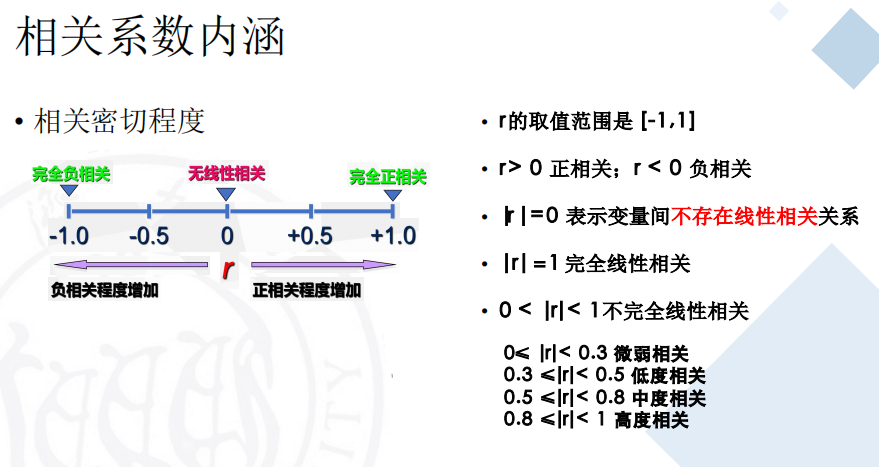
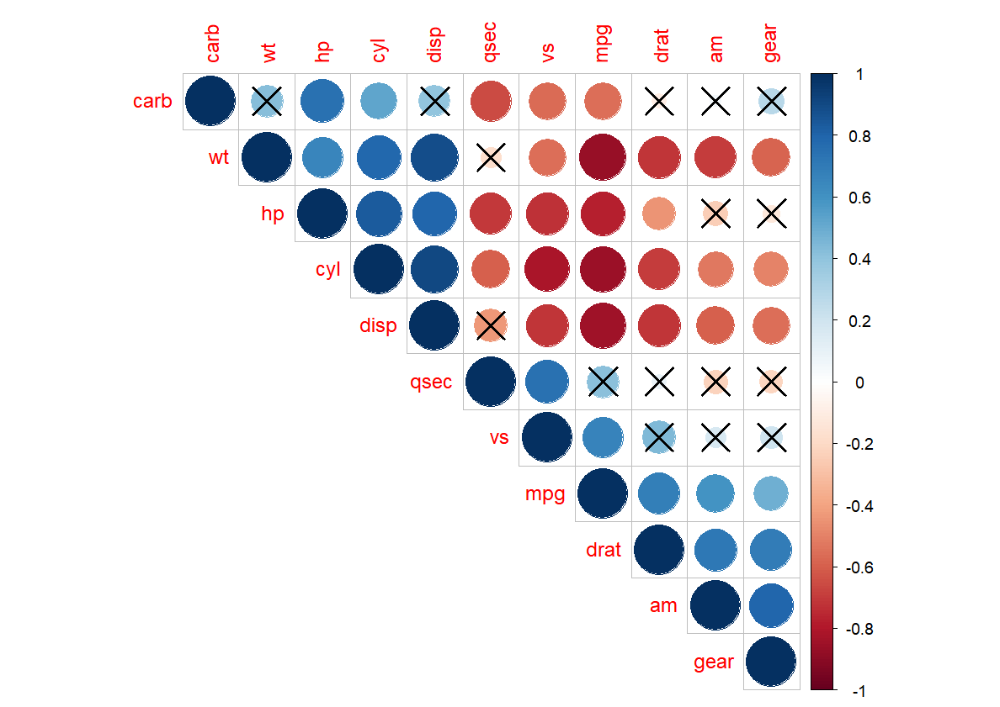

# 相关分析

## 相关关系
### 变量之间的关系
- 函数关系、确定关系$y = f(x)$
- 相关关系、非确定关系$y = f(x) + \varepsilon$

### 因素数量
- 单相关、一元相关，两个因素之间
- 复相关、多元相关，三个或三个以上因素之间
  - 偏相关，在复相关中，其他自变量**固定不变**时因变量与自变量之间的相关

### 相关形态
- 线性相关
- 非线性相关

### 相关方向
- 正相关
- 负相关

### 相关程度
- 完全相关
- 不完全相关
- 不相关

## 相关系数
coefficient of crrelation描述了两个变量之间线性关系的密切程度和相关方向

相关系数计算
- **Pearson**相关系数
- spearman/kendall相关系数

### 计算
- 根据**总体全部数据**计算，总体相关系数，记为$\rho = \frac{Cov(X, Y)}{\sqrt{Var(X)Var(Y)}}$
- 根据样本数据计算，样本相关系数，记为$r =  \frac{\sum(x - \bar x)(y - \bar y)}{\sqrt{\sum(x - \bar x)^2 \sum(y - \bar y)^2}} = \frac{n\sum x y - \sum x \sum y}{\sqrt{n \sum x^2 - (\sum x)^2 \sqrt{n \sum y^2 - (\sum y)^2}}}$



#### 实例分析
1. 随机生成正态分布数据
```R
x = rnorm(10)
y = 1:10
cor(x, y, method = "pearson")
cor(x, y, method = c("pearson", "kendall", "spearman"))
cor(x, y, method = "pearson", use = "complete.obs") # 处理缺失值
```

输出
```
> x = rnorm(10)
> y = 1:10
> cor(x, y, method = "pearson")
[1] -0.1321558
> cor(x, y, method = c("pearson", "kendall", "spearman"))
[1] -0.1321558
> cor(x, y, method = "pearson", use = "complete.obs") # 处理缺失值
[1] -0.1321558
```
2. 多个因素

丢进入就两两配对计算相关系数
```R
> library(dplyr)
> colnames(mtcars)
 [1] "mpg"  "cyl"  "disp" "hp"   "drat" "wt"  
 [7] "qsec" "vs"   "am"   "gear" "carb"
> dat = select(mtcars, mpg, disp, hp, drat, wt, qsec)
> head(dat)
                   mpg disp  hp drat    wt  qsec
Mazda RX4         21.0  160 110 3.90 2.620 16.46
Mazda RX4 Wag     21.0  160 110 3.90 2.875 17.02
Datsun 710        22.8  108  93 3.85 2.320 18.61
Hornet 4 Drive    21.4  258 110 3.08 3.215 19.44
Hornet Sportabout 18.7  360 175 3.15 3.440 17.02
Valiant           18.1  225 105 2.76 3.460 20.22
> round(cor(dat), 2)
       mpg  disp    hp  drat    wt  qsec
mpg   1.00 -0.85 -0.78  0.68 -0.87  0.42
disp -0.85  1.00  0.79 -0.71  0.89 -0.43
hp   -0.78  0.79  1.00 -0.45  0.66 -0.71
drat  0.68 -0.71 -0.45  1.00 -0.71  0.09
wt   -0.87  0.89  0.66 -0.71  1.00 -0.17
qsec  0.42 -0.43 -0.71  0.09 -0.17  1.00
```
## 相关系数显著性检验
由**样本相关系数**对**总体相关系数**的理论真值做出具有一定把握程度的推断

1. 提出假设
   - $H_0: \rho = 0$
   - $H_1: \rho \ne 0$
2. 构造计算检验统计量$t = r\frac{\sqrt{n - 2}}{\sqrt{1 - r^2}} \sim t(n-2)$
3. 根据$\alpha$确定临界值$t_{\alpha/2}$
   - 若$|t| \lt t_{\alpha/2}(n - 1)$，接受$H_0$表示线性相关不显著
   - 若$|t| \ge t_{\alpha/2}(n - 1)$，拒绝$H_0$表示线性相关显著

### 实例分析
1. 两个因素
```R
> cor.test(x, y, method = "pearson", use = "complete.obs")

	Pearson's product-moment correlation

data:  x and y
t = -0.3771, df = 8, p-value = 0.7159
alternative hypothesis: true correlation is not equal to 0
95 percent confidence interval:
 -0.7032643  0.5426214
sample estimates:
       cor 
-0.1321558 

```

可以看出p值比较大，不能拒绝

2. 多个因素
```R
> library(Hmisc)
> library(dplyr)
> dat = select(mtcars, mpg, disp, hp, drat, wt, qsec)
> rcorr(as.matrix(dat))
       mpg  disp    hp  drat    wt  qsec
mpg   1.00 -0.85 -0.78  0.68 -0.87  0.42
disp -0.85  1.00  0.79 -0.71  0.89 -0.43
hp   -0.78  0.79  1.00 -0.45  0.66 -0.71
drat  0.68 -0.71 -0.45  1.00 -0.71  0.09
wt   -0.87  0.89  0.66 -0.71  1.00 -0.17
qsec  0.42 -0.43 -0.71  0.09 -0.17  1.00

n= 32 


P
     mpg    disp   hp     drat   wt     qsec  
mpg         0.0000 0.0000 0.0000 0.0000 0.0171
disp 0.0000        0.0000 0.0000 0.0000 0.0131
hp   0.0000 0.0000        0.0100 0.0000 0.0000
drat 0.0000 0.0000 0.0100        0.0000 0.6196
wt   0.0000 0.0000 0.0000 0.0000        0.3389
qsec 0.0171 0.0131 0.0000 0.6196 0.3389       
```

可以通过`cor.test`算出每对的cor和p值

## 数据可视化
### 基本的
```R
> cor_4 = cor(mtcars[1:6])
> symnum(cor_4, abbr.colnames = F)
     mpg cyl disp hp drat wt
mpg  1                      
cyl  +   1                  
disp +   *   1              
hp   ,   +   ,    1         
drat ,   ,   ,    .  1      
wt   +   ,   +    ,  ,    1 
attr(,"legend")
[1] 0 ‘ ’ 0.3 ‘.’ 0.6 ‘,’ 0.8 ‘+’ 0.9 ‘*’ 0.95 ‘B’ 1
```

### corrplot
`install.packages("corrplot")`
```R
M<-cor(mtcars)
  require(corrplot)
  corrplot(M, method = "circle")
  corrplot(M, method = "ellipse")
  corrplot(M, method = "pie")
  corrplot(M, method = "color")
  corrplot(M, method = "number")
  corrplot(M, type = "upper")
  corrplot(M, type = "lower")
  corrplot(M, order = "hclust")
  # Change background color to lightgreen and color of the circles to darkorange and steel blue
  corrplot(M, type = "upper", order = "hclust", col = c("darkorange", "steelblue"),bg = "lightgreen")
  # 标记出设定检验水平下有意义的点
  cor_5 <- rcorr(as.matrix(mtcars))
  M <- cor_5$r
  p_mat <- cor_5$P
  corrplot(M, type = "upper", order = "hclust", p.mat = p_mat, sig.level = 0.01)
```
