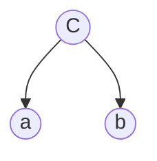
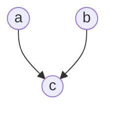

[TOC]

# 贝叶斯分类器

## 贝叶斯决策论

看到了一些特征判断属于哪一类的

Bayes Theorem
$p(c_j|d) = \frac{p(d|c_j)p(c_j)}{p(d)}$

$p(c_j)$先验知识，数据集中的类$c_j$占比
$p(d|c_j)$对于每个类别，计算给定该类别下观察到的特征的条件概率。
分母都一样，一般不用管

两个模型
- 生成式模型，Bayes classifier学习类别的联合概率分布，来估计给定输入的后验概率。
- 逻辑回归、支持向量机、神经网络等都是判别式模型，它们通过学习决策边界直接对输入进行分类。

MaximumA Posterior(MAP)，两个后验概率算出来哪个大就要那个，标记label

## 朴素贝叶斯
前提是特征之间相互独立

判断影响因素之间是否相关性
- 连续型变量用相关系数

例子
|Name|Sex|
|:-:|:-:|
|Drew|Male|
|Claudia|Female|
|Drew|Female|
|Drew|Female|
|Alberto|Male|
|Nina|Female|
|Karia|Female|
|Serigo|Male|

5个女的，3个男的，对于给定的Drew

$p(c_j|d) = \frac{p(d|c_j)p(c_j)}{p(d)}$

叫drew的前提下是male的概率，$\frac{1}{3}$是男的中叫drew的概率
$p(male|drew) = \frac{\frac{1}{3} \times \frac{3}{8}}{\frac{3}{8}}$
叫drew的前提下是female的概率
$p(female|drew) = \frac{\frac{2}{5} \times \frac{5}{8}}{\frac{3}{8}}$

多个因素就多次乘积

### R实例分析
`naiveBayes(features, labels)`: 使用`naiveBayes`函数构建朴素贝叶斯分类器，传入特征矩阵和标签向量
```r
library(e1071)
classifier <- naiveBayes(iris[,c(1:4)],iris[,5])
classifier
```

列联表查看预测的结果
```r
table(predict(classifier, iris[,-5]), iris[,5])
```
### 问题

#### Zero Conditional Probability Problem

在朴素贝叶斯分类器中，当某个特征在给定类别下从未观察到时，会导致条件概率为零。这可能发生在训练数据中某个类别中没有出现某个特征的情况下。因为朴素贝叶斯假设特征之间是独立的，所以如果在训练集中某个类别下从未观察到某个特征，那么该特征的条件概率就变成了零，这可能导致整个后验概率的计算为零。

解决方法：
- 平滑技术：使用平滑技术，如拉普拉斯平滑（Laplace smoothing），来避免出现概率为零的情况。这会给所有特征的计数增加一个小的值，以确保所有特征都有非零的条件概率。

#### Violation of Independence Assumption

朴素贝叶斯分类器假设特征之间是条件独立的。这意味着在给定类别的情况下，任何两个特征之间都是独立的。然而，在实际数据中，特征之间可能存在一定的相关性。

违反独立性假设可能会导致模型的性能下降，因为它可能无法捕捉到特征之间的复杂关系。

解决方法：
- 使用更复杂的模型：如果特征之间存在较强的相关性，可以考虑使用更复杂的模型，如决策树、支持向量机或神经网络，这些模型能够更灵活地捕捉特征之间的关系。
- 特征工程：通过选择更相关的特征或通过对特征进行变换，可以减轻特征之间独立性假设的违反。
- 这里介绍的方法是升级为Bayesian Network贝叶斯网络
  
## 贝叶斯网络
允许变量之间是有关系的，受到一个清晰的有向循环图的约束

就只用根据依赖关系建立条件概率

没有前驱节点就看边缘概率

### Diverging

a的概率依赖于c，b的概率依赖于c

$p(a,b,c) = p(c) * p(a|c) * p(b|c)$

### Converging


$p(a, b, c) = p(a) * p(b) * p(c|a, b)$
$p(a, b, c) = p(a, b) * p(c|a, b)
$p(a, b) = p(a) * p(b)$

### Serial


$p(a,b,c) = p(c) * p(c|a) * p(b|c)$

## 贝叶斯推断

## R实例分析
目前只是建立的依赖关系(咨询专家)，但是其中还没有数据
也可以用`hc()`hill climbing爬山算法去构建依赖关系
```r
library(bnlearn)
structure <- empty.graph(c("high_hc", "high_hg", "sport"))
plot(structure)
modelstring(structure) <- "[high_hc][sport][high_hg|sport:high_hc]"
plot(structure)
```
在结构中加入数据
```r
ais.sub <- ais[ais$sport %in% c("Netball", "Tennis", "W_Polo"), c("high_hc", "high_hg", "sport")]
ais.sub$sport <- factor(ais.sub$sport)
bn.mod <- bn.fit(structure, data = ais.sub)
bn.mod
```
然后就可以进行任何的计算了`cpquery`